# Flow: the minimal and beautiful music player

A lightweight music player for Windows 11 (x64), built with C# / WPF on .NET 10. It brings your local music
**and** your Spotify library onto the same album shelves, with a modern take on the classic mid-2000s iTunes
feel: big album art, a living visualizer, an LCD-style display, and six looks from see-through to dark brushed metal.

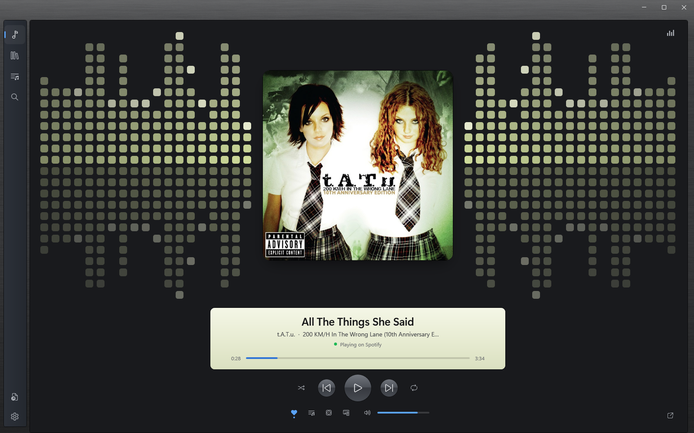

**At a glance**
- Local files and Spotify in one library, one queue, one player
- Search all of Spotify with suggestions as you type, and play anything, including full albums
- Built-in Spotify playback (no Spotify app needed) with Flow's EQ and visualizer
- A pop-out mini player that floats above your windows, from full album art down to a slim LCD bar
- Edit your own music like iTunes: rename songs, fix album details and track order, add cover art
- Six appearance themes, nine visualizers, adjustable artwork and text sizes
- Free per-user installer with one-click updates from inside Flow

## Screenshots

### Six looks
| Dark Brushed Metal | Brushed Metal |
|---|---|
|  | 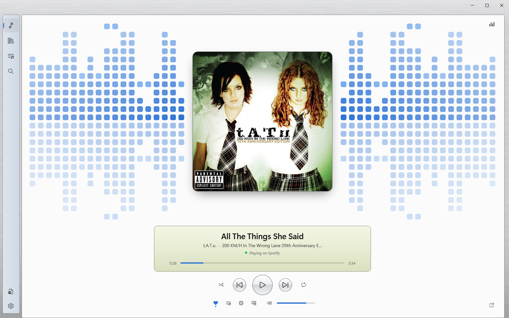 |
| **Dark** | **Light** |
| 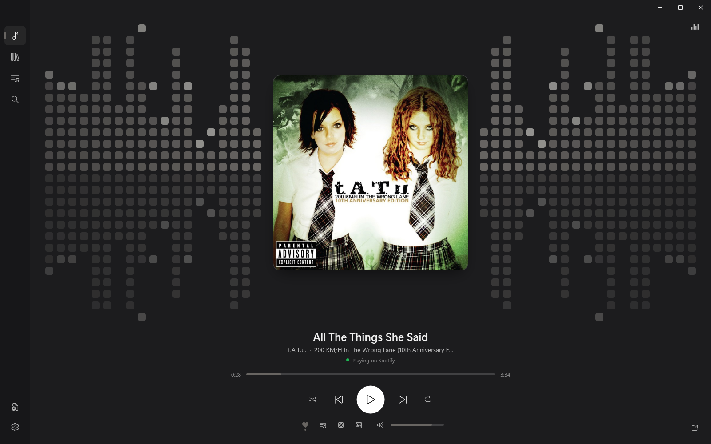 | 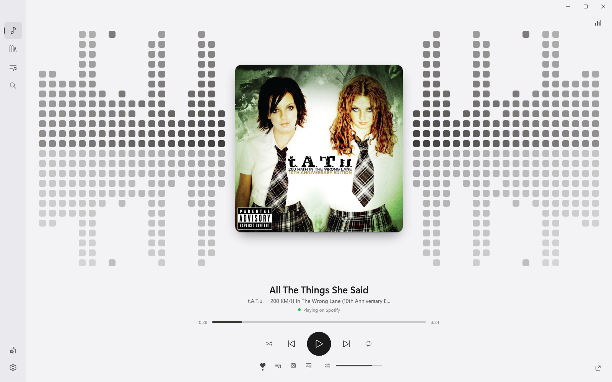 |

Plus **Minimal**, a translucent look that lets your desktop show through, and **Automatic**, which follows
Windows' light or dark mode.

### Your library
Album shelves, here filtered to the Electro and Alternative genres, and the sortable song table.

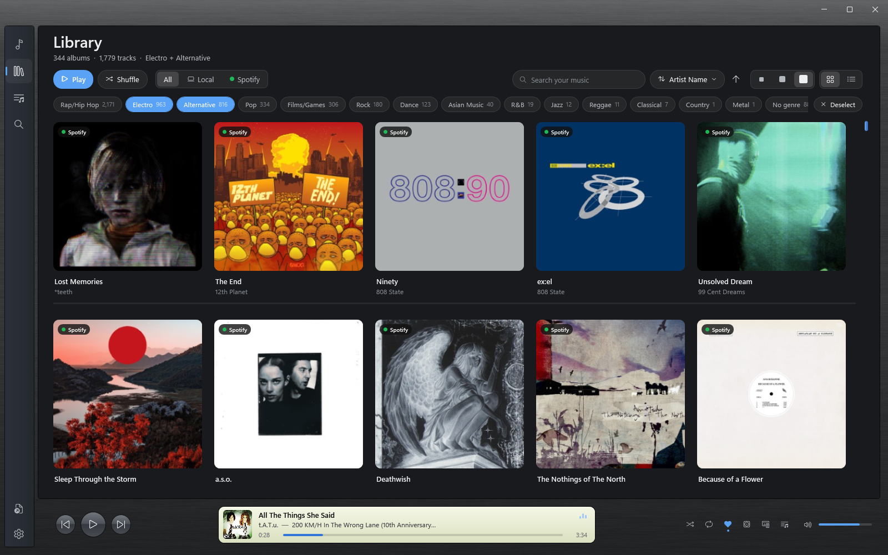

| Songs | Album spotlight |
|---|---|
| 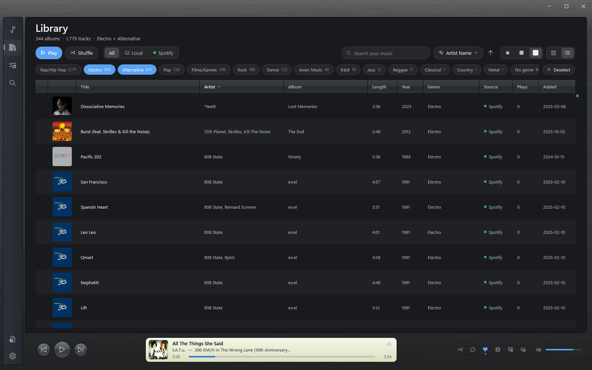 | 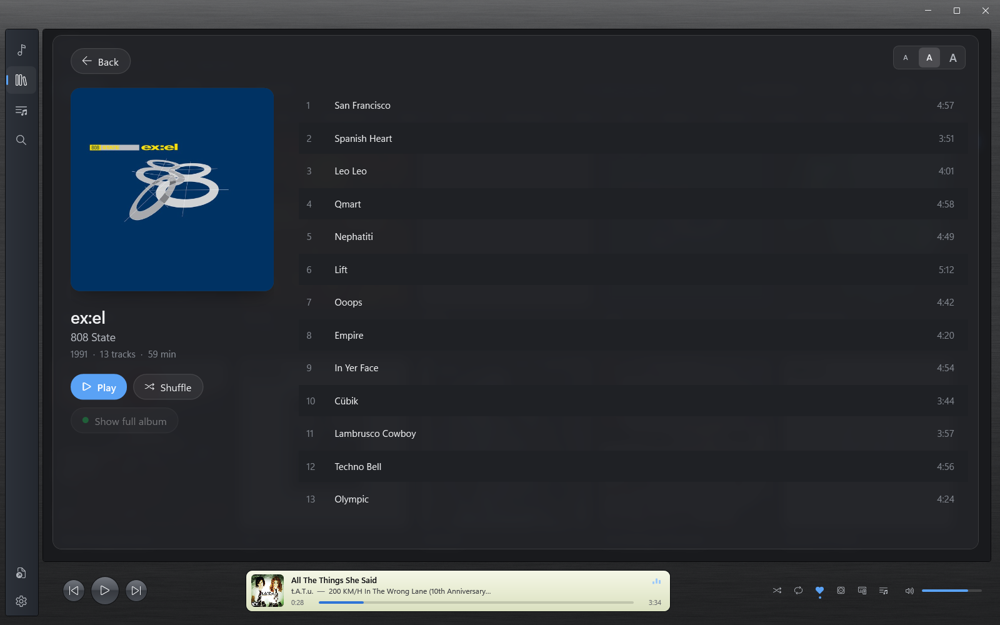 |
| **Artist page** | **Settings** |
| 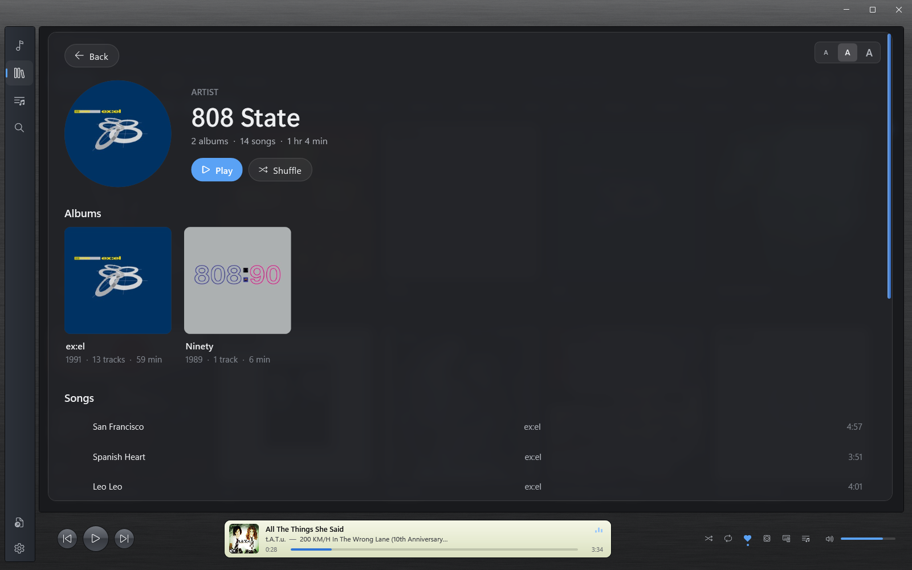 | 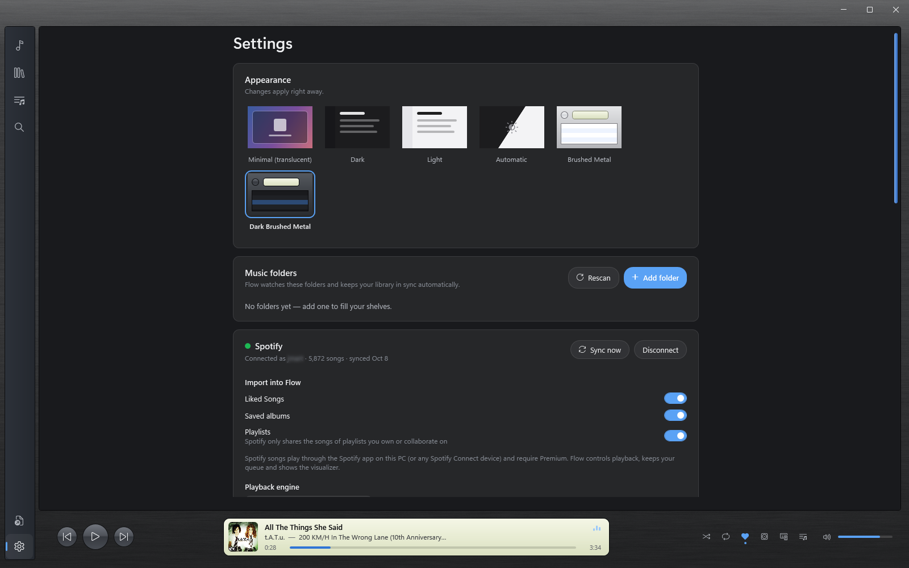 |

### Search all of Spotify
A big search bar that suggests artists, songs and albums as you type. Pick one and the bar moves up for the results.

| Search | Suggestions | Results |
|---|---|---|
| 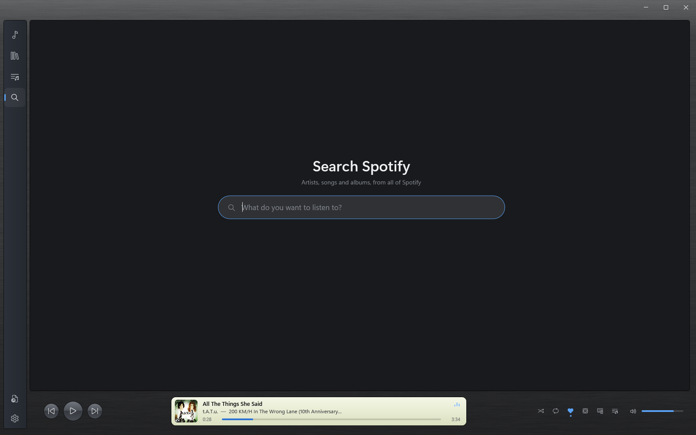 | 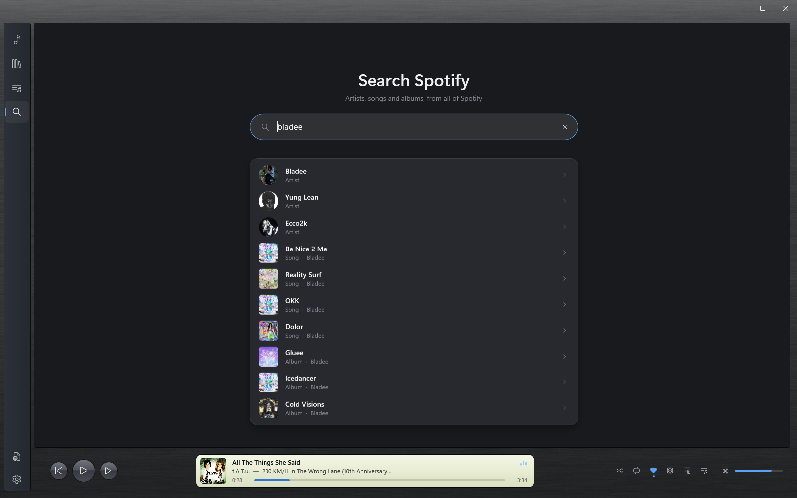 | 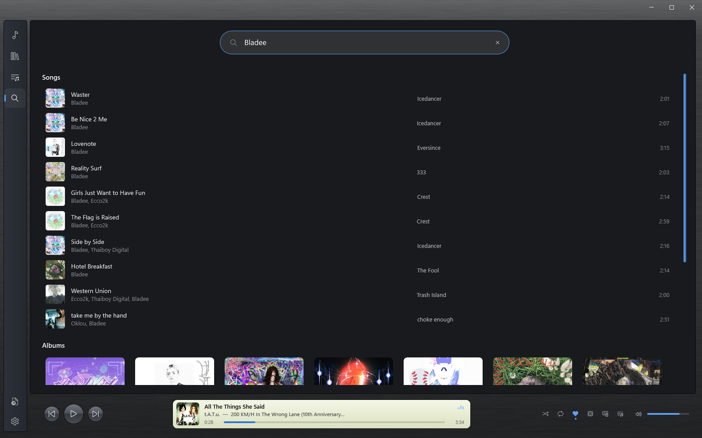 |

### Visualizers
| Spectrum Bars | Radial Ring | Particle Field |
|---|---|---|
| 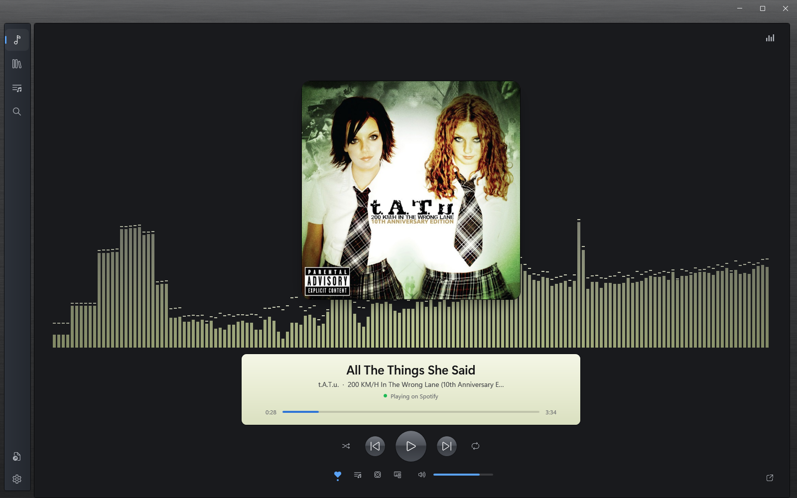 | 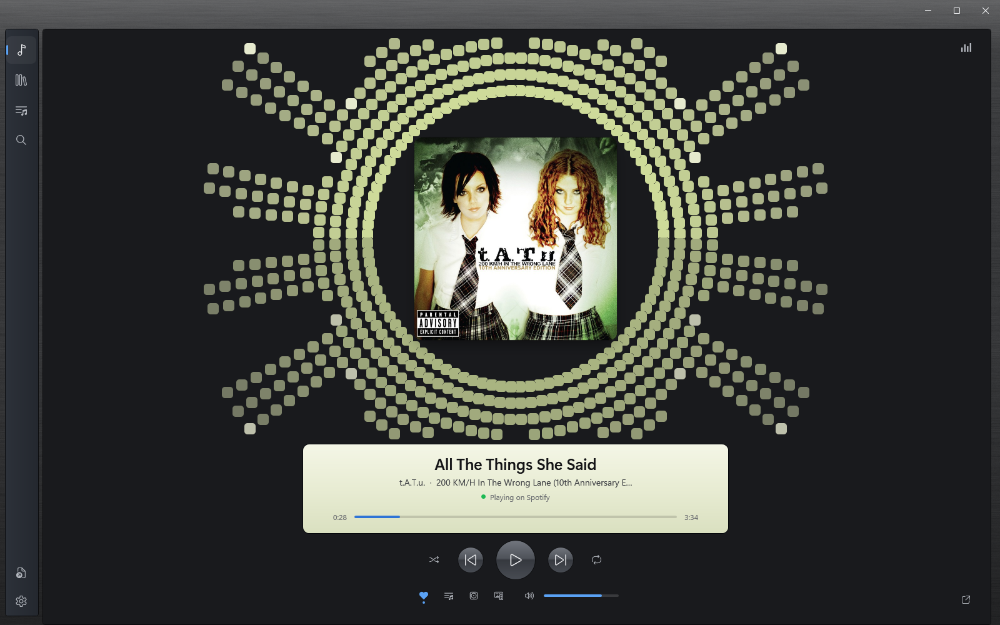 | 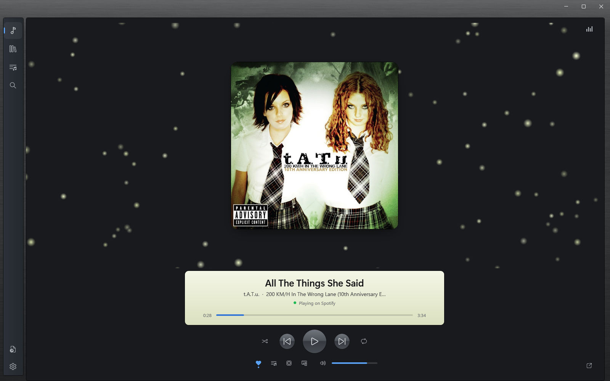 |

### Pop-out mini player
Album art with every control on hover, or stretch it into a slim LCD bar.

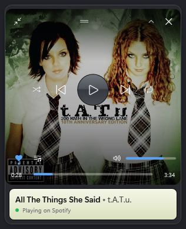

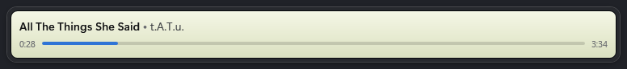
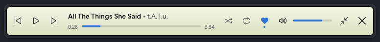

## Install
Download **`Flow-Setup-x64-<version>.exe`** from the [Releases](../../releases) page and run it. No administrator
rights needed: Flow installs for your Windows account into `%LOCALAPPDATA%\Programs\Flow`, adds a Start menu
shortcut (and optionally a desktop one), and appears in **Settings, Apps** (publisher Joseph Martinez) with an
Uninstall button.

**Updates:** Flow checks for a new version once a day. Open **Settings, About** and press **Update now**: Flow
downloads the new setup, checks it against GitHub's checksum, updates itself and reopens, picking up the song where
you left off. Running a newer setup by hand works too, and always keeps your library and settings.

Windows SmartScreen may say "Windows protected your PC" because Flow isn't code-signed: choose **More info, Run
anyway**.

Prefer no installer? `Flow-win-x64.zip` is the portable version: unzip it and run `Flow.exe` (keep `librespot.exe`
next to it).

## Features
**Looks**
- **Appearance themes** (Settings, Appearance; switch instantly):
  - **Minimal**: translucent, so a backdrop such as the Windhawk *Translucent Windows* mod shows through.
  - **Dark**, **Light**, and **Automatic** (follows Windows).
  - **Brushed Metal**: a mid-2000s homage with a brushed-aluminum window, glossy round buttons, a pale-green LCD
    display, a blue-gray source list and striped track lists.
  - **Dark Brushed Metal**: the same in graphite, with the pale-green LCD glowing against it and a visualizer to match.
- **9 visualizer styles + Off**: Mirrored Blocks, Radial Ring, Mirror Mountains, Spectrum Bars, Oscilloscope,
  Spectrogram, Block Rain, Particle Field, Bass Halo. Cycle with the button top-right (right-click = previous).
- **Adjustable sizes**: Small / Medium / Large album artwork in the Library and Playlists, and an **aA** text size
  for the album spotlight, artist pages and Playlists.

**Playing**
- **Now Playing**: centered album art, timeline, Previous / Play-Pause / Next (tap to skip, hold to rewind or
  fast-forward), shuffle, repeat, favorite, volume (scroll on the art too), **Go to album**, and **Play on another
  device** for Spotify songs. Artist and album names are links into the library.
- **Pop-out mini player** (bottom-right of Now Playing): floats above all your windows while Flow minimizes.
  - Hover for play/pause, previous, next, shuffle, repeat, favorite, Up Next, volume and the timeline; they fade
    away a few seconds after you move off.
  - Resize it freely from any edge or corner. With room for a cover you get the art with the LCD under it; make it
    short or small and it becomes a slim LCD bar whose text and buttons adapt to its size.
  - Double-click the art (or Back to Flow) to return; it remembers where you put it.
- **Player bar**: iTunes-style controls with an LCD display on every page except Now Playing.
- **Up Next queue**: play next, add to queue, drag to reorder.
- **Audio**: 10-band EQ with presets, crossfade (0 to 12 s), gapless playback, ReplayGain (track / album).
- **Keeps your place**: the queue and position are saved as you listen and restored when Flow starts or updates.

**Your music**
- **Library**: album-cover shelves or a sortable track table (Title, Artist, Album, Length, Year, Genre, Source,
  Plays, Date Added), instant search, and an **All / Local / Spotify** filter.
- **Genre chips**: pick one or more genres to filter the shelves and table; Play and Shuffle follow them.
- **Favorites**: heart a song, then pick **Favorites** in the sort menu to see only your hearted songs and their albums.
- **Artist pages and album spotlight**: click an artist for their albums, appearances and songs; click an album for
  a full-page spotlight with a blurred backdrop. **Show full album** fetches a Spotify album's complete tracklist.
- **Edit your own music** (local files only, never Spotify songs), saved into the files themselves:
  - Right-click a song: **Rename**, **Edit info** (title, artist, album, album artist, genre, year, track and
    disc number), **Edit album**, **Choose cover artwork**.
  - **Edit album** (also in the album spotlight): album name, album artist, genre and year for every song, each
    song's title and artist, and the track order.
  - **Cover art** from a JPG, PNG or WebP picture, saved into every song of the album.
- **Playlists** with album covers: create, rename, reorder (drag), import / export `.m3u8`; smart lists for
  Favorites, Recently Added, Most Played and Recently Played; your own Spotify playlists.
- **Formats**: MP3, AAC / M4A, ALAC, FLAC, WAV, WMA, OGG Vorbis, Opus, AIFF.

**Spotify** (Premium; details below)
- Imports Liked Songs, saved albums and your playlists onto the same shelves, with genres. After the first sync
  only what's new or changed is downloaded.
- **Search** (magnifying glass in the left rail): a big search bar with suggestions as you type (artists, songs,
  albums, with pictures). Use the arrow keys and Enter, or click: an artist shows their songs and albums, a song
  plays, an album opens in the spotlight.
- Two playback engines: the **Spotify app**, or **Built-in** playback inside Flow.

**Windows**
- Media keys, the Windows 11 media flyout and lock screen, taskbar thumbnail buttons and progress, optional tray
  icon, drag and drop, single instance, optional "Open with" for audio files.
- **Lean and smooth**: the visualizer rests when it's off or Flow is minimized and runs at most 60 fps; covers are
  decoded at display size with a small shared cache; pages are built in the background so switching screens is
  instant; Spotify is followed through Windows' media events instead of constant polling.

## Spotify (Premium)
Flow can import your Spotify library onto the same shelves as your local music and play it.
Spotify audio is DRM-protected, so it plays through the **Spotify app** (on this PC or any Spotify Connect
device) or Flow's **Built-in** engine (below). Flow keeps one queue across local and Spotify songs, and the
visualizer follows the sound.

One-time setup (Settings, Spotify). Each person uses their own free developer app:
1. Open the [Spotify Developer Dashboard](https://developer.spotify.com/dashboard) and choose **Create app**.
2. Add the Redirect URI `http://127.0.0.1:43117/callback`, tick **Web API**, save.
3. Paste the app's **Client ID** into Flow and press **Connect Spotify**, then approve in the browser.

What's imported: Liked Songs, saved albums, and playlists you own or collaborate on (Spotify no longer
shares the contents of playlists you only follow). Flow syncs automatically every 12 hours, or press
**Sync now**. Genres come from Deezer's public catalog (Spotify no longer provides them to personal
apps). The sign-in token is stored encrypted for your Windows account; **Disconnect** removes it.

### Built-in playback
Settings, Spotify, **Playback engine** offers **Built-in** next to the default **Spotify app**.
Flow then runs [librespot](https://github.com/librespot-org/librespot) as a hidden background process that signs in
to your Spotify Premium account, appears in Spotify Connect as a device named "Flow", and streams the decoded audio
straight into Flow. Spotify songs then get Flow's EQ, volume and visualizer, and the Spotify app doesn't need to run.

- **Set up playback** opens Spotify's approval page once; librespot keeps its own sign-in in
  `%LOCALAPPDATA%\Flow\librespot`. **Sign out of playback** deletes it.
- Options: device name, bitrate (96 / 160 / 320 kbps), volume normalisation, start with Flow.
- Live playback only: audio is never saved to disk (librespot's own encrypted cache is capped at 1 GB).
- Unofficial: librespot isn't endorsed by Spotify and may stop working when Spotify changes things. Premium only.
- Seeking restarts the song at the new spot (librespot ignores Spotify's seek command), so expect a short blip.
- `librespot.log` in `%LOCALAPPDATA%\Flow` records the engine's own messages (no tokens).

## Keyboard shortcuts
| Key | Action |
|---|---|
| Space | Play / pause |
| ← / → | Seek ∓5 s |
| Ctrl+← / Ctrl+→ | Previous / next |
| ↑ / ↓ | Volume |
| M | Mute |
| Ctrl+S / Ctrl+R | Shuffle / repeat |
| Ctrl+F / Ctrl+L / Ctrl+P | Search / Library / Now Playing |
| Ctrl+O | Open files |
| Esc | Close album / artist page, queue; in Search, close suggestions or clear |

## Data
Settings, the library database, cached artwork and the Spotify cache live in `%LOCALAPPDATA%\Flow`.
`spotify.log` there records Spotify playback steps and saved places (no tokens). Set `FLOW_DEBUG=1` for a `debug.log`.

## Build
Requires the [.NET 10 SDK](https://dotnet.microsoft.com/download).
```
dotnet publish src/Flow -c Release -r win-x64 --self-contained -p:PublishSingleFile=true -p:IncludeNativeLibrariesForSelfExtract=true -o publish
```
Intermediate build output goes to `%LOCALAPPDATA%\FlowBuild` (see `Directory.Build.props`) so cloud-synced
folders don't lock it.

### Optional: librespot (built-in Spotify playback)
Flow's optional built-in Spotify engine runs [librespot](https://github.com/librespot-org/librespot) (MIT) as a
background process. It is not in git; build it once before publishing:

1. Install [Rust](https://rustup.rs) (MSVC toolchain) and the Visual Studio 2022 Build Tools with the
   "Desktop development with C++" workload.
2. Run `powershell -ExecutionPolicy Bypass -File tools\build-librespot.ps1`. This builds librespot v0.8.0 with
   only the pipe audio backend and rustls, and copies it to `tools\librespot\librespot.exe`.
3. Publish as above: `librespot.exe` is copied next to `Flow.exe` in `publish\`.

Without `librespot.exe`, Flow builds and runs as usual and the built-in engine is simply unavailable.
See `THIRD-PARTY-NOTICES.md` for librespot's license.

### Installer
`installer\Flow.iss` builds the per-user setup with the free [Inno Setup 6](https://jrsoftware.org/isinfo.php)
(`winget install JRSoftware.InnoSetup --scope user`). After publishing:
```
powershell -ExecutionPolicy Bypass -File tools\build-installer.ps1 -PublishDir publish
```
Output: `installer\Output\Flow-Setup-x64-<version>.exe`. Silent install / update:
`Flow-Setup-x64-<version>.exe /VERYSILENT /SUPPRESSMSGBOXES /NORESTART /CLOSEAPPLICATIONS`
(add `/RELAUNCH=1` to reopen Flow afterwards, `/RESUME=1` to keep playing). Each run leaves a log in `%TEMP%`.

### Developer options (Debug builds only)
These read your real settings and library but never write them.

| Command | What it does |
|---|---|
| `Flow.exe --screenshots <folder>` | Renders the README screenshots off-screen (Spotify account name blurred) |
| `Flow.exe --render-library <folder> [artist]` | Renders Library / artist / album / Search / Settings / mini player off-screen, logs binding errors |
| `Flow.exe --render-visualizers <folder>` | Renders every visualizer style to PNGs (synthetic signal) |
| `Flow.exe --test-tags <folder> [webp]` | Makes test songs, edits their details and cover art, and checks the files from scratch |
| `Flow.exe --test-sync <file>` | Checks incremental Spotify sync against a simulated library (offline) |
| `Flow.exe --perf-switch <file>` | Times switching between screens |
| `Flow.exe --memory-test <file>` | Library + cover memory measurement |
| `Flow.exe --memory-ui <file>` | Runs the real UI off-screen and records memory per step |
| `Flow.exe --test-genres <file>` | Dry-run genre lookups for 40 albums |
